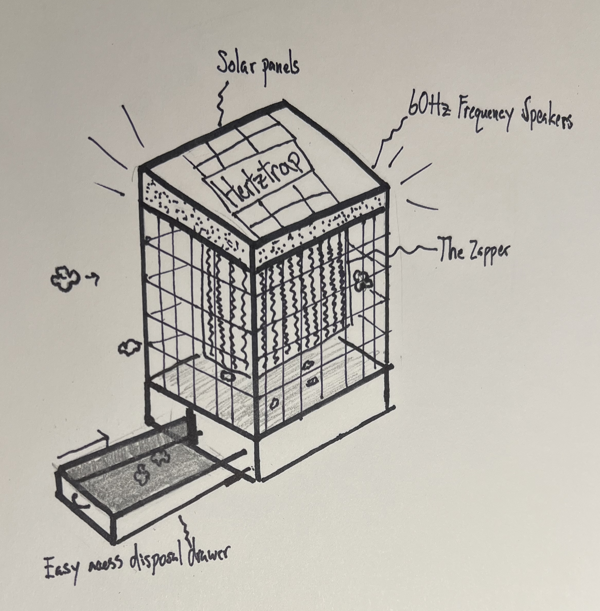

# HertzTrap: Frequency-Based Spotted Lanternfly Deterrent

**Team:** _Newtons Nightmares_
**Client(s):** Cornell CALS Extension / E\&J Gallo Winery / National Grape  

## Problem statement

Farmers in vineyards are trying to continue growth and production of their vineyards. However,
the growing population of Spotted Lanternflies (SLFs) puts significant pressure on farmers as these
insects feed off grapevines, lowering yield and significantly damaging or killing the plants. The SLF
is an exceptionally harmful pest because there are no natural predators and regular pest control
does not work effectively. When harvesting, if more than 2 SLFs are found in a 1 kg sample of
harvest, the entire section must be discarded per health code—a devastating loss for farmers already
running on thin margins. Our team is aiming to take advantage of the SLF’s documented attraction
to 60 Hz frequencies and create a product that draws SLFs away from grapevines.

## Impact
SLF infestations prevent farms from passing health code inspections, forcing the discard of otherwise
viable harvests. This directly threatens farm profitability and viability. A product that removes
SLFs from grapevines before harvest can prevent yield loss, help farms meet health codes, and
significantly increase both productivity and profit margins.

## Proposed direction(s)

### Concept A (primary): HertzTrap

**What it is:** 

A modified electric insect trap designed to attract adult SLFs using a 60 Hz vibrational or frequency based stimulus, based on published observations of SLF responsiveness to specific frequency cues.
  
**How it would be used:**
- Traps are installed along vineyard perimeters or near vine canopies before harvest
- Device emits 60 Hz stimulus to attract SLFs away from grape vines
- SLFs fly into an electrified grad and are neutralized before entering vineyard
-  Device will operate continuously during migration window

**Why it’s better than the status quo:** 
- Targets SLFs before they enter vineyards and have access to grapes
- Avoids pesticide application, and some manual labor involving removing flies
- Uses simple and observed electrical components instead of a high precision sorting system 

**End-of-semester proof-of-concept:** 

We will develop a full CAD model with real-world dimensions along with a scaled-down HertzTrap shell built to accurate proportions. The shell will include an internal slot and 60 Hz speaker, plus a PLA or ABS mesh outer layer to represent the electrically charged shock layer.

<Only include if you want the client to compare two directions. Keep short.>

## Key risks / unknowns

- Attraction Strength: SLFs may not respond strongly enough to 60 Hz cues in open vineyard environments - test with outdoor trials.
- Nontarget effects: The trap may attract or harm beneficial insects - evaluate trap selectivity through observational testing.
- Farmer adoption: Vineyard operators may resist adopting new devices due to cost or integration concerns - confirm placement, maintenance, and perceived value through client feedback.
- Environmental durability: Outdoor weather and dust may reduce performance - evaluate possible materials, durability and placement strategies.

## Questions for the client

1. What kind of strength do you expect out of a smaller sized trap? Can we expect to place many of these around farms or should we amp up sizing to account for minimal placements?
  
2. Will disposing of flies be an issue for farms? Currently we do not account for the locations of the dead flies, but if disposal is a concern, we can build to minimize the aftereffects.

3. Is it a major environmental problem for the shock feature to harm non-SLF animals/pests of similar sizing/behaviour?

\newpage

# References figure

## References

- Wine Market Value - https://www.grandviewresearch.com/industry-analysis/us-wine-market 
- Spotted Lanternfly Information - https://cals.cornell.edu/integrated-pest-management/outreach-education/whats-bugging-you/spotted-lanternfly/spotted-lanternfly-damage
- 60 Hz Research - https://www.usda.gov/about-usda/news/blog/spotted-lanternfly-reveals-potential-weakness

## Figure

